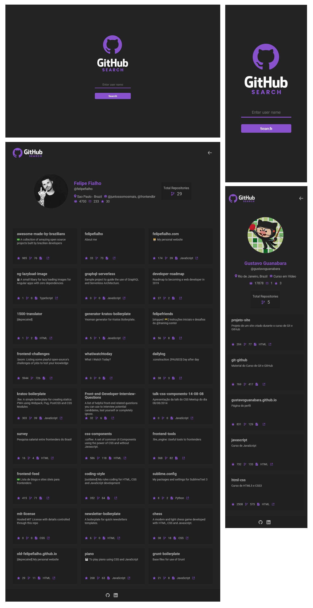

 

    
     

  <h3 align="center">Profile component by <a href="https://github.com/Diegooliveyra">Diego Oliveira</a></h3>
  
  

     Perfil de um usuário
        
     
    <a href="https://github.com/Diegooliveyra/Github_Search">Desafio</a>
    ·
    <a href="https://www.devchallenge.com.br/">DevChallenge</a>
  

## Índice

* [Devchallenge](#devchallenge) 
* [Desafio](#desafio)
* [Techs](#techs)
* [Como começar](#como-começar)
* [Dicas](#dicas)  
  * [Cores](#cores)
  * [Modelo](#modelo)
  * [Imagens](#imagens)
  * [Icones](#icones)
  * [Tipo de fonte](#tipo-de-fonte)
* [Compartilhe](#compartilhe)

# Devchallenge
<a href="https://devchallenge.now.sh/"> DevChallenge</a> permite que você evolua suas skills como programador! Participe da nossa <a href="https://discord.gg/yvYXhGj">comunidade</a> o/

# Desafio
Seu desafio é criar um site de busca de usuarios e repositorios do github através da sua API! O modelo final está disponível na pasta "design"

## Requisitos:
- A pagina inicial precisa ter um campo de busca, a busca devera ser feita ao clicar no botão de busca ou ao clicar no tecla Enter 
- A resposta da página deverá exibir as informaçes do usuario, tais como nome, followers , following, stars, empresa e localização 
- A resposta da página deverá exibir as informaçes dos repositórios, tais como o nome do repositório, descrição do projeto, stars, forks e um link que direciona para o repositório no Github 

# Techs: 
- HTML
- CSS
- JAVASCRIPT
- FRAMEWORK JS (opcional)

# Como começar:
1 - Use esse template (clicando em Use this template) ou faça um fork deste repositório com o código inicial 
2 - Leia as instruções no readme.md 
3 - Comece a codar! Sinta-se livre para utilizar o fluxo de trabalho que ache mais confortável 
4 - Compartilhe seu resultado com a comunidade! #devchallenge

# Dicas

## Documentação API Github (em pt-BR):

<a href="https://docs.github.com/pt/rest/guides/getting-started-with-the-rest-api">Github API</a>

## Cores:
Background: #232324 
Black: #201F1F 
Purple: #8752CC 
Gray: #B2B2B2 

## Modelo:
O modelo final desktop está disponível na pasta `./design` 
Caso prefira, o layout esta disponivel no <a href="https://www.figma.com/file/m5JYqvEa6Zi4zZ7kkfMYJ1/Github-Search?node-id=3%3A28"> Figma </a> 

    

## Icones
Para os ícones, recomendamos que utilize alguma biblioteca, como o Font Awesome

## Tipo de fonte:
- Roboto

# Compartilhe!
Inicie seu projeto utilizando esse template no seu github como um repositório público 
Faça um print, gif ou vídeo e compartilhe o resultado com a #devchallenge ou marcando nosso perfil @devchallenge! 

Desafio criado por  <a href="https://www.linkedin.com/in/diego-de-oliveira-brito/">Diego Oliveira</a> :)

# Comunidade DevChallenge
Site: https://www.devchallenge.com.br/  
Discord: https://discord.gg/yvYXhGj  
Linkedin: https://www.linkedin.com/company/devchallenge/ 
Twitter: https://twitter.com/dev_challenge 
Instagram: https://www.instagram.com/devchallenge/ 
